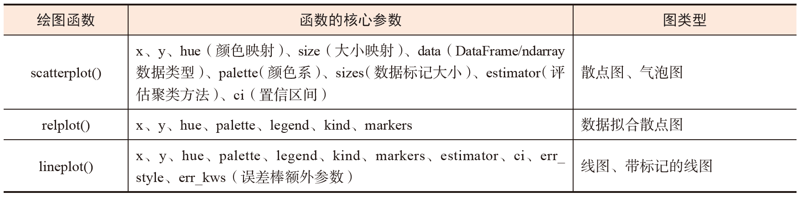

<!DOCTYPE html>
<html lang="en">
<head>
    <meta charset="UTF-8">
    <meta name="viewport" content="width=device-width, initial-scale=1.0">
    <title>Document</title>
</head>
<body>
    
<h1>Python可视化库————Seaborn</h1>

    
Seaborn在Matplotlib的基础上进行了更加高级的封装，用户能够使用极少的代码绘制出拥有丰富统计信息的科研论文配图

    <h2>图类型</h2>
    
Seaborn在创建之初就将可绘制的图进行了分类，读者可根据数据类型选择绘制相应的图，从而实现高效绘图

    
Seaborn提供的可绘制图类型包括统计关系型、数据分布型、分类数据型、回归模型分析型和多子图网格型。

    <ol>
        <li>关系型图</li>
        
数据集变量间的相互关系和相互依赖的程度都可以通过统计分析变量间的相关性获知。

        
Seaborn提供的scatterplot()、relplot() 和lineplot()函数可用于绘制反映数据间关系的图。

        
Seaborn中的关系型图绘制函数如下表

        

        <li>数据分布型图</li>
        
在对数据进行分析或建模之前，我们需要先了解数据的分布情况，以及数据的覆盖范围、中心趋势、异常值等基本情况。

        
Seaborn提供的多个绘图函数可用于可视化数据的分布情况。

        
Seaborn 中的数据分布型图绘制函数如下表

        

        <li>分类数据型图</li>
        
在面对数据组中具有离散型变量（分类变量）的情况时，我们可使用以X轴或Y轴作为分类轴的绘图函数来绘制分类数据型图

        
Seaborn中常见的分类数据型图绘制函数如下表

        
        

        <li>回归模型分析型图</li>
        
可以使用回归模型分析型图表示数据集中变量间的关系，使用统计模型来估计两组变量间的关系。

        
Seaborn 提供了多个展示线性回归模型的可视化图绘制函数。

        
Seaborn中的回归分析型图绘制函数如下表

        
    </ol>

    <h2>多子图网格型图</h2>
    
相比Matplotlib，Seaborn 提供了多个子图网格绘图函数，它们可快速实现分面图的展示。

    
在面对按数据子集绘图、分行或分列显示子图和不同类型图组合等绘图要求时，多子图网格绘制功能不但可以一次性可视化展示数据集中各变量的变化情况，而且可以减少绘制复杂图的时间。

    <ol>
        <li>FacetGrid()函数</li>
        
Seaborn 提供的FacetGrid() 函数可实现数据集中任一变量的分布和数据集子集中多个变量之间关系的可视化展示。

        
FacetGrid() 函数可以实现行、列、色调3 个维度的数值映射，其中，行、列维度与所得的轴阵列有明显的对应关系，色调变量可被视为沿深度轴的第三维，用不同的颜色绘制不同级别的数据

        
使用FacetGrid()函数绘制分面图示例的核心代码如下：

        <pre>
import Seaborn as sns
import matplotlib.pyplot as plt
g = sns.FacetGrid(df, col ='time', hue ='smoker')
g.map(sns.regplot, "total_bill", "tip")
g.add_legend()
        </pre>
        
FacetGrid()函数绘制分面图结果如下

        

        <li>PairGrid()函数</li>
        
PairGrid()函数主要用于绘制数据集中具有成对关系的多子图网格型图。

        
在PairGrid()函数中，每个行和列都会被分配一个不同的变量，这就导致绘制结果为显示数据集中成对变量间关系的图。这种图也被称为“散点图矩阵”。

        
PairGrid()函数绘制分面图示例的核心代码如下：

        <pre>
import Seaborn as sns
import matplotlib.pyplot as plt
penguins = sns.load_dataset("penguins")
x_vars = ["body_mass_g", "bill_length_mm", "bill_depth_mm",]
y_vars = ["body_mass_g"]
g = sns.PairGrid(penguins, hue="species", x_vars=x_vars, y_vars=y_vars)
g.map_diag(sns.histplot, color=".3")
g.map_offdiag(sns.scatterplot)
g.add_legend()
        </pre>
        
PairGrid()函数绘制分面图结果如下：

        
    </ol>

    <h2>绘图风格、颜色主题和绘图元素缩放比例</h2>
    
和Matplotlib相比，Seaborn有更多的绘图风格和颜色主题，它们可用于绘制不同样式的图。

    <ol>
        <li>绘图风格</li>
        
使用Seaborn 的set_style()函数并设置其参数style，即可设定图的绘制风格。

        
参数style的可选值包括darkgrid、whitegrid、dark、white和ticks，参数rc则用于覆盖预设Seaborn样式字典中的值的参数映射，只更新样式中的一部分参数。

        
4种绘图风格的可视化效果如下

        

        <li>颜色主题</li>
        
我们可通过Seaborn的set_palette()函数更改颜色主题，该函数包含多色系、单色系和双色渐变色系3类颜色主题，不同颜色主题的显示效果可通过sns.color_palette()函数来查看。

        
Seaborn中部分颜色主题选项的可视化效果如下

        

        <li>绘图元素缩放比例</li>
        
通过设置Seaborn中set_context()函数的参数context，我们可以实现对绘图元素的缩放处理。

        
参数context的可选值为paper、notebook（默认）、talk 和 poster，缩放比例依次增大。

        
context参数4种值对应的缩放效果如下

        
    </ol>
</body>
</html>