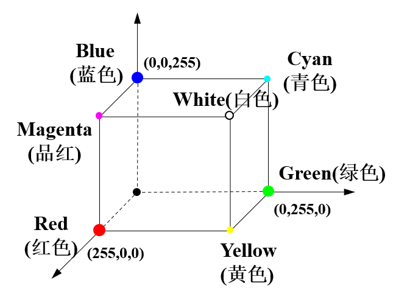
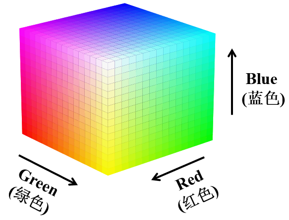
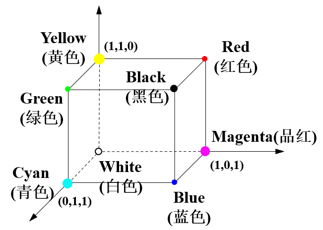
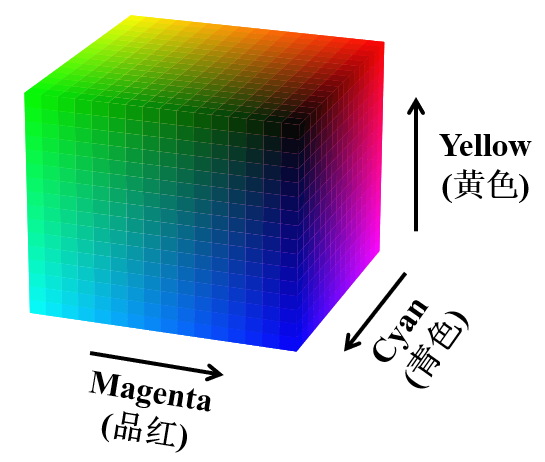
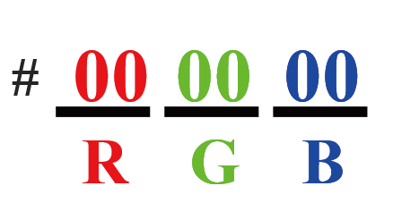
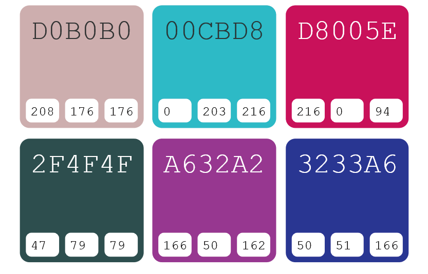

# 科研论文配图的绘制与配色基础
## 科研论文配图的绘制基础
### 绘制规范
绘制科研论文首先要确保它的规范性，即绘制的配图要符合投稿期刊要求的配图格式。

1. 科研论文的配图的分类

| 配图类型  |  简介  |
|  :------:  |  :------:  |
|  线性图  |  一种用直线段连接数据点的图形，用于显示数据随时间或其他连续变量的变化  |
|  灰度图  |  一种单通道图像，每个像素只有一个采样颜色，通常显示为从最暗黑色到最亮的白色的灰度  |
|  照片彩图  |  指彩色的照片，也就是每个像素值都分成R、G、B三个基色分量，每个基色分量直接决定其基色的强度，这样产生的色彩称为真彩色  |
|  综合配图  |  将多张图片进行整合，形成一个整体的图像  |

线性图是主要和常用的配图类型，如折线图、散点图、柱形图等。
线性图是一种加工费时、设置细节较多的图表类型。

2. 科研论文配图的构成

| 结构 | 介绍 |
| :----: | :----: |
| X轴 | X axis, 又称横轴 |
| Y 轴 | Y axis，又称纵轴 |
| X 轴标签 | X axis label，X轴标签是指X轴上方的标签，通常用来表示数据的值 |
| Y 轴标签 | Y axis label，Y轴标签是指Y轴上方的标签，通常用来表示数据的值 |
| 主刻度 | Major tick，主刻度是指坐标轴上的主要刻度线，通常用来表示数据的主要变化范围 |
| 次刻度 | Minor tick，次刻度是指主刻度之间的次要刻度线，通常用来表示数据的部分变化范围 |
| 图例（Legend） | 图片下方那段简短的说明文字，所以也可以更形象地将其理解为图注或图片说明 |

科研论文配图基本构成示例如下：

3. 科研论文配图的格式和尺寸

| 像素图常见格式 | 简单介绍 |
| :----: | :----: |
| JPEG | JPEG是Joint Photographic Experts Group的缩写，是一种针对相片图像而广泛使用的一种有损压缩标准方法 |
| PSD | PSD是Photoshop Document的缩写，是Adobe公司的图像处理软件Photoshop的专用格式。这种格式可以存储Photoshop中所有的图层，通道、参考线、注释等信息，是目前最通用的图像文件格式之一 |
| PNG | PNG是Portable Network Graphics的缩写，是一种无损压缩的位图片形格式，可以直接作为素材使用，因为它有一个非常好的特点——背景透明 |
| TIFF | TIFF是标签图像文件格式（Tag Image File Format，TIFF）的缩写，是一种灵活的位图格式，主要用来存储包括照片和艺术图在内的图像，最初由Aldus公司与微软公司一起为PostScript打印开发 |

| 矢量图常见格式 | 简单介绍 |
| :----: | :----: |
| ESP | EPS是封装的PostScript(Encapsulated PostScript)格式，是Adobe公司设计用于向任何支持PostScript语言的打印机打印文件的页面描述语言 |
| PDF | PDF是Portable Document Format的缩写，意为“可携带文档格式”，是由Adobe Systems Incorporated开发的文件格式。PDF文件不仅可以存储字符信息，还可以存储字体和字符大小，字体装饰，嵌入图像，布局等信息 |
| AI | AI格式是Adobe Illustrator的文件格式，是一种矢量图形文件格式。 AI格式的文件是由绘图软件Illustrator生成的，Illustrator绘图软件可以生成很多格式如ai、eps、pdf、jpg等文件格式 |
| SVG | SVG是可缩放矢量图形（Scalable Vector Graphics，SVG）的缩写，是一种基于XML标记语言的描述二维矢量图形的文件格式。SVG文件可以无限放大而不失真，适用于图形设计、地图制作、排版等领域 |

对于像素图，一般的科学引文索引（Science Citation Index，SCI）期刊都要求插图的分300dpi辨率大于300dpi

4. 科研论文配图中的字体和字号设置
* 一些中文科技期刊将科研论文配图中的文本对象（横、纵坐标的标签，以及图例文本）的字体设置为宋体或黑体
* 英文科技期刊大多使用Arial、Helvetica 或Times New Roman 字体设置为科研论文配图中的文本对象
* 同一幅插图中的字体必须一致
* 如果插图中确有需要突出的部分，则可以将它们设置为粗体或斜体形式，或者更改文字颜色

5. 科研论文配图的版式设计、结构布局和颜色搭配
* 版式设计方面，配图中文字的字体要保持一致，字号不大于正文字体的字号，行距、文字间距应与正文协调一致
* 在结构布局方面，配图应出现在引用文字的下方或右侧，即“先文后图”，不同尺寸的配图不要安排在同一列或同一行
* 在颜色搭配方面，我们应避免使用过亮或过暗的颜色，相邻的图层元素不宜采用相近的颜色

### 绘制原则

<table>
   <tr>
        <td>必要性原则</td>
        <td>
科研论文配图的主要应用场景包括结构表达、体系构建、模型研究、数据预处理及分析、调查统计等，而在这些应用场景中，判断是否真的需要使用配图
</td>
   </tr>
   <tr>
        <td>易读性原则</td>
        <td>
完整、准确的标题、标签和图例等可以有效地增强科研论文配图的易读性
</td>
   </tr>
   <tr>
        <td>一致性原则</td>
        <td><li>配图所表达出的内容与上下文或者指定内容描述一致</li> 
            <li>配图数据与上下文保持一致</li> 
            <li>插图比例尺和缩放比例大小保持一致</li> 
            <li>类似配图各图层要素保持一致</li>
        </td>
   </tr>
</table>

## 科研论文配图的配色基础
### 色彩模式
常见的色彩模式包括RGB色彩模式、CMYK色彩模式和HEX色彩模式

1. RGB 色彩模式
* RGB 色彩模式是指通过混合红（Red）、绿（Green）、蓝（Blue）3 种颜色来表现各种色彩
* RGB 色彩模式为图片中每一个像素的R、G、B 各分配一个强度值（取值范围为0 ～ 255），如黑色可表示为(0,0,0)，白色可表示为(255,255,255)。

  

    
    
RGB色彩模式的三维立方体示意图

  

  

      
    
使用Python的Matplotlib库绘制的对应立方体颜色映射效果图/p>
  

2. CMYK 色彩模式
* CMYK 色彩模式可以看作RGB 色彩模式的子集。它是一种主要用于彩色印刷的四色模型，其中，C 表示青色（Cyan），M 表示品红色（Magenta），Y 表示黄色（Yellow），K 表示黑色（blacK）
* 纸质期刊在稿件出版阶段都会要求图片使CMYK色彩模式
* 对于网络版本的期刊，我们应该使RGB色彩模式，因为使用该色彩模式的图片，其表现效果好，色彩靓丽，更适合在网络上传播

  

    
    
CMYK色彩模式三维立方体示意图

  

  

      
    
使用Python的Matplotlib库绘制的对应立方体颜色映射效果图

  

3. HEX 色彩模式
* HEX 色彩模式，又称十六进制色彩模式，它和RGB 色彩模式的原理类似，都是通过红、绿、蓝三原色的混合而产生各种颜色
* HEX色彩模式就是将RGB色彩模式中的每个十进制数转换为对应的两位十六进制数来表示，并以“#”号开头

  

    
    
HEX 色彩模式的十六进制数表示

  

  

      
    
HEX色彩模式中的颜色示例

  

### 色轮配色原理
色轮（color wheel）又称色环，一般由12种基本颜色按照圆环方式排列组成,它是一种人为规定的色彩排列方式

<table>
    <tr>
        <td>
            单色配色方案
        </td>
        <td>
            <li>单色配色方案是指将色相相同或相近的一组颜色进行组合</li> 
            <li>单色配色方案还具备相同色系的协调性，在使用过程中，不会出现颜色过于鲜艳的情况，保证了所选颜色之间的平衡性</li> 
            <li>单色配色方案常被用于表示有直接关系、关系较为密切或同系列的数据</li>
        </td>
    </tr>
    <tr>
        <td>
            互补色配色方案
        </td>
        <td>
            <li>当只能选择两种颜色时，我们可参考互补色配色方案进行选择</li> 
            <li>可用于科研论文配图中观察组数据和对照组数据的可视化表达</li>
        </td>
    </tr>
    <tr>
        <td>
            等距三角配色方案
        </td>
        <td>
            <li>等距三角配色方案会让配图的颜色更加丰富，但它在科研论文配图绘制的过程中应用较少</li>
        </td>
    </tr>
    <tr>
        <td>
            四角配色方案
        </td>
        <td>
            <li>四角配色方案有两种，一种是实线表示的两对互补色组成的矩阵配色方案，另一种是虚线表示的方形配色方案</li> 
            <li>四角配色方案的优点是能够使配图的颜色更加丰富，缺点是使用时具有很大的挑战性，容易造成色彩杂乱，很多用户其实很难平衡自己选择的多种颜色</li>
        </td>
    </tr>
</table>

<!DOCTYPE html>
<html>
<head>

</head>
<body>

  

    
    
利用单色配色方案绘制的可视化配图示例1

  

  

      
    
利用单色配色方案绘制的可视化配图示例2

  

</body>
</html>

 

  

    
    
利用互补色配色方案绘制的可视化配图示例1

  

  

      
    
利用互补色配色方案绘制的可视化配图示例2

  

 

  

    
    
利用等距三角配色方案绘制的可视化配图示例1

  

  

      
    
利用等距三角配色方案绘制的可视化配图示例2

  

 

  

    
    
利用四角配色方案绘制的可视化配图示例1

  

  

      
    
利用四角配色方案绘制的可视化配图示例2

  

 

### 颜色主题
* Python中常用的绘图工具Matplotlib和Seaborn都有其颜色主题，颜色主题对用户（尤其是初学者）友好，使用户不必将大量时间浪费在配色的选择上
* 一些英文期刊会有自己的一套颜色主题，用户在投稿时将插图配色更改为期刊要求的颜色主题即可
* Matplotlib 库的颜色主题主要包括3 种类型：单色系（sequential）、双色渐变色系（diverging）和多色系（qualitative）

<table>
    <tr>
        <td>
            单色系
        </td>
        <td>
            <li>单色系主题中颜色的色相基本相同，饱和度单调递增</li> 
            <li>单色系主题的次要维度是色调（hue），即较暖的颜色出现在较亮的一端，较冷的颜色则会出现在较暗的一端</li> 
        </td>
    </tr>
    <tr>
        <td>
            双色渐变色系
        </td>
        <td>
            <li>双色渐变色系颜色主题主要用在有一个关键中心值（midpoint）的数值变量中</li> 
            <li>中心值通常被指定为浅色，距中心点越远，颜色越深</li>
        </td>
    </tr>
    <tr>
        <td>
            多色系
        </td>
        <td>
            <li>当所表示的数据为类别型数值（类别变量）时，我们可以使用多色系颜色主题</li> 
            <li>在多色系颜色主题的使用过程中，需要给每个组分配不同的颜色</li> 
            <li>可尝试将颜色主题中的颜色类别设置为10种或更少，而使用过多的颜色类别，可能造成分组混乱，导致杂乱的视觉效果</li>
        </td>
    </tr>
</table>

  

    
    
Matplotlib 库中部分单色系颜色主题(Sequential colormaps)

  

  

      
    
Matplotlib 库中双色渐变色系颜色主题(Diverging colormaps)

  

  

    
    
Matplotlib 库中部分多色系颜色主题(Qualitative colormaps)

  

### 配色工具
* Color Scheme Designer 网站中的高级在线配色器
* Adobe Color
* ColorBrewer 2.0
